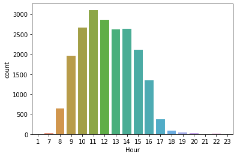
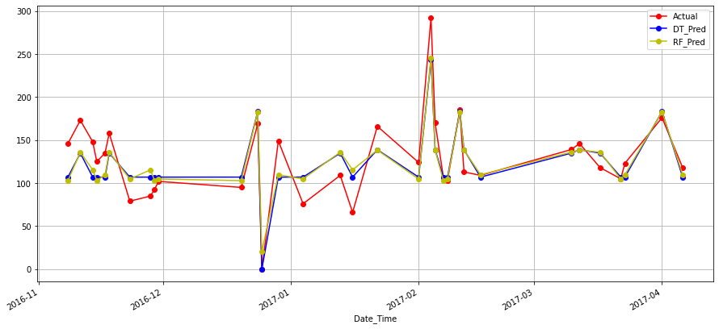

# Bakery Transaction

> Edinburgh, Scotland 베이커리의 판매 데이터 분석 

<br>

**💡 분석 목표**

- 베이커리 판매에 영향을 주는 요인 찾기

- 베이커리 판매량 예측하기
- 세트 상품으로 출시하면 좋을 조합 제안하기

| 목차                                                    | 내용                                                         |
| ------------------------------------------------------- | ------------------------------------------------------------ |
| [1. EDA](#1.-EDA)                                       | 베이커리 데이터의 탐색적 분석과 전처리                       |
| [2. Market Basket Analysis](#2.-Market-Basket-Analysis) | 판매량이 높은 상품 사이의 연관규칙 발견                      |
| [3. Regression](#3.-Regression)                         | 이벤트와 공휴일 변수를 추가하여 판매에 미치는 영향 확인, 판매량 예측 |
| [4. Decision Tree](#4.-Decision-Tree)                   | 이벤트와 공휴일 변수를 추가하여 판매에 미치는 영향 확인, 판매량 예측 |

<br>

## 1. EDA

> 베이커리 데이터의 탐색적 분석과 전처리

[📝 노트북 보러가기](./1-bakery-transaction-eda)

데이터: 2016년 10월 30일부터 2017년 4월 9일까지의 Edinburgh, Scotland 베이커리의 판매 데이터

- 총 21293개의 관측치, 4개의 변수
- 결측치 값은 NONE으로 설정

| 변수명      | 변수 설명 | 자료 형태        |
| :---------- | :-------- | :--------------- |
| Date        | 거래일    | 날짜(YYYY-MM-DD) |
| Time        | 거래시간  | 시간(HH:MM:DD)   |
| Transaction | 거래번호  | 거래의 일련번호  |
| Item        | 판매품목  | 상품명           |

- 베스트 셀러는 커피, 빵, 티, 케이크, 페스츄리, 샌드위치, 크루와상, 핫초콜릿이다.
- 일주일 중 토요일이 가장 바쁘며 수요일이 가장 한가하다.
- 가장 바쁜 시간대는 10:00 ~ 14:00 이며 전반적으로는 아침 시간대에 판매량이 많다. 점심 혹은 점심 전후의 티타임에 전반적으로 판매량이 높은 것으로 추정된다.

|  |  |  |
| ----------------------------- | ------------------------------- | ------------------------------- |


<br>

## 2. Market Basket Analysis

> 판매량이 높은 상품 사이의 연관규칙을 찾아 세트 상품으로 출시하면 좋을 조합을 찾아본다

[📝 노트북 보러가기](./2-bakery-transaction-market-basket-analysis)

세트 상품으로 출시하면 좋을 조합은 Cake와 Hot chocolate 또는 Tea, Spanish Brunch와 Coffee, Toast와 Coffee, Sandwich와 Tea이다.

<br>

## 3. Regression

> Edinburgh, Scotland의 이벤트 데이터와 공휴일 데이터를 추가하여 베이커리 판매에 미치는 영향을 확인하고 판매량을 예측한다

[📝 노트북 보러가기](./3-bakery-transaction-regression)

- 베이커리의 일일 판매량을 예측하기 위한 최적의 모델은 다중 선형 회귀 모델이다.
- 판매량에 가장 큰 영향을 주는 변수는 holiday 즉, 공휴일 변수이다.

```
Items = 8.46805389 Week_Day_Friday -12.95723347 Week_Day_Monday +  56.92043484 Week_Day_Saturday + 11.56000791 Week_Day_Sunday   + -14.58750167 Week_Day_Thursday  -24.920835 Week_Day_Tuesday  + -24.4829265 Week_Day_Wednesday  + 60.11428571 event_day  -121.58045977 holiday
```

|  |  |
| ------------------------------- | ------------------------------------- |

<br>

## 4. Decision Tree

[📝 노트북 보러가기](./4-bakery-transaction-decision-tree)

- Week_Day_Saturday와 holiday가 예측에 있어서 가장 중요한 변수라고 볼 수 있다.
- Regression과 비슷한 결과를 내고 있지만 예측 정확도는 떨어진다.

|  |  |
| --------------------------- | ----------------------------------- |


